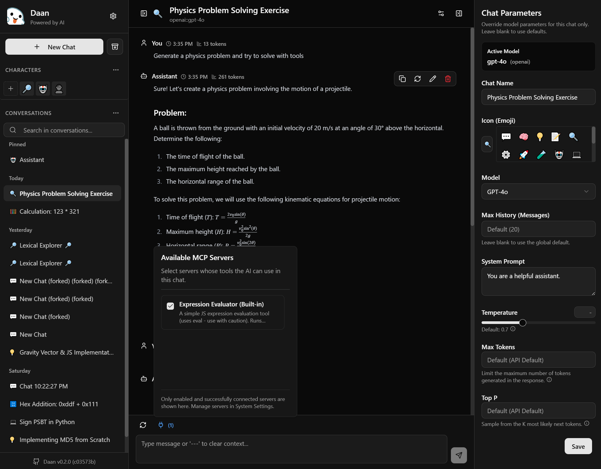

 A Lightweight Language Model Client

# Dáàn

English | [中文](使用说明.md)

Daan (答案，"Answer" in Chinese) is a concise and lightweight LLM client designed to provide you with a smooth and efficient AI experience. It is compatible with OpenAI's GPT series.

## Screenshots

View Demo at [Here](https://daan.xyzw.space)

Dark mode:

Light mode:

## Features

- **Minimalist Interface:** Focuses on core functionality, eliminating redundancy and allowing you to concentrate on the conversation.
- **Flexible Model Selection:** Supports custom models, making it easy to switch to your preferred LLM.
- **Custom API Address:** In addition to OpenAI, you can use other compatible APIs.
- **Secure Storage:** API keys are securely stored locally in the browser, so you don't have to worry about leaks.
- **Personalized Settings:** Customize system prompts, the number of historical messages, etc., to create your own AI assistant.
- **Theme Switching:** Supports night mode to protect your eyes.
- **Timestamp Display:** Convenient for tracking conversation history.
- **Chat Summary:** Chat summary feature to help you quickly review conversation content.
- **Token Estimation:** Estimate the number of tokens used in a message.
- **Conversation Pinning:** Pin important conversations to the top of the list.

## Quick Start

1.  **Get an API Key:** You need a valid OpenAI API key (or a key for another compatible API).
2.  **Configure Daan:** Enter your API key in Daan's settings, and you can also select the model you want to use.
3.  **Start a Conversation:** Click "+ New Chat" to start a new conversation, enter your question, and Daan will provide you with an answer!

## Usage

- **Model Selection:** Select the LLM model you want to use in the settings. You can use predefined models, or add custom models.
- **System Prompt:** By customizing the system prompt, you can change the behavior of the AI. For example, you can have the AI play the role of an expert in a specific field.
- **Number of Historical Messages:** Control the number of historical messages sent to the API, which can save token consumption.
- **More Settings:** Adjust other settings according to your needs, such as theme, timestamp display, etc.

## Contribution

Everyone is welcome to participate in the development of Daan! You can contribute in the following ways:

- Submit Issue: Report bugs or suggest new features.
- Submit Pull Request: Fix bugs or add new features.
- Participate in Discussions: Participate in discussions and share your ideas.

## License

Daan is licensed under the AGPL-3.0 license, see the [LICENSE](LICENSE) file for details.

Non-commercial use is completely free, commercial use requires authorization (free authorization, but registration is required).
