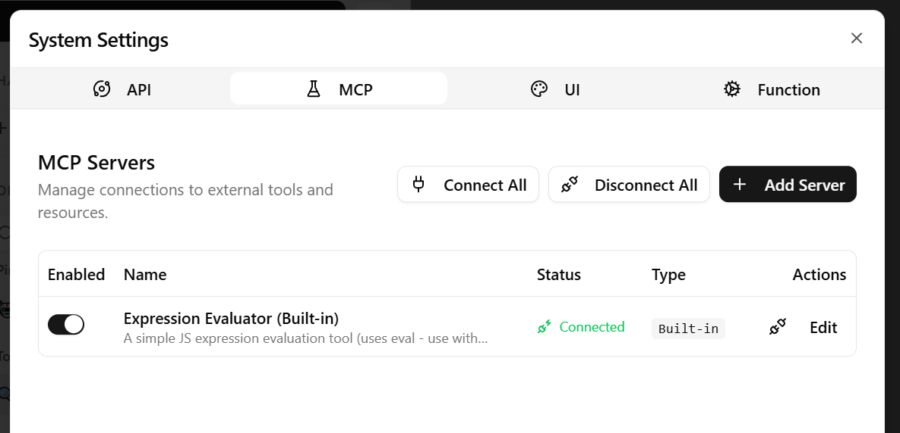
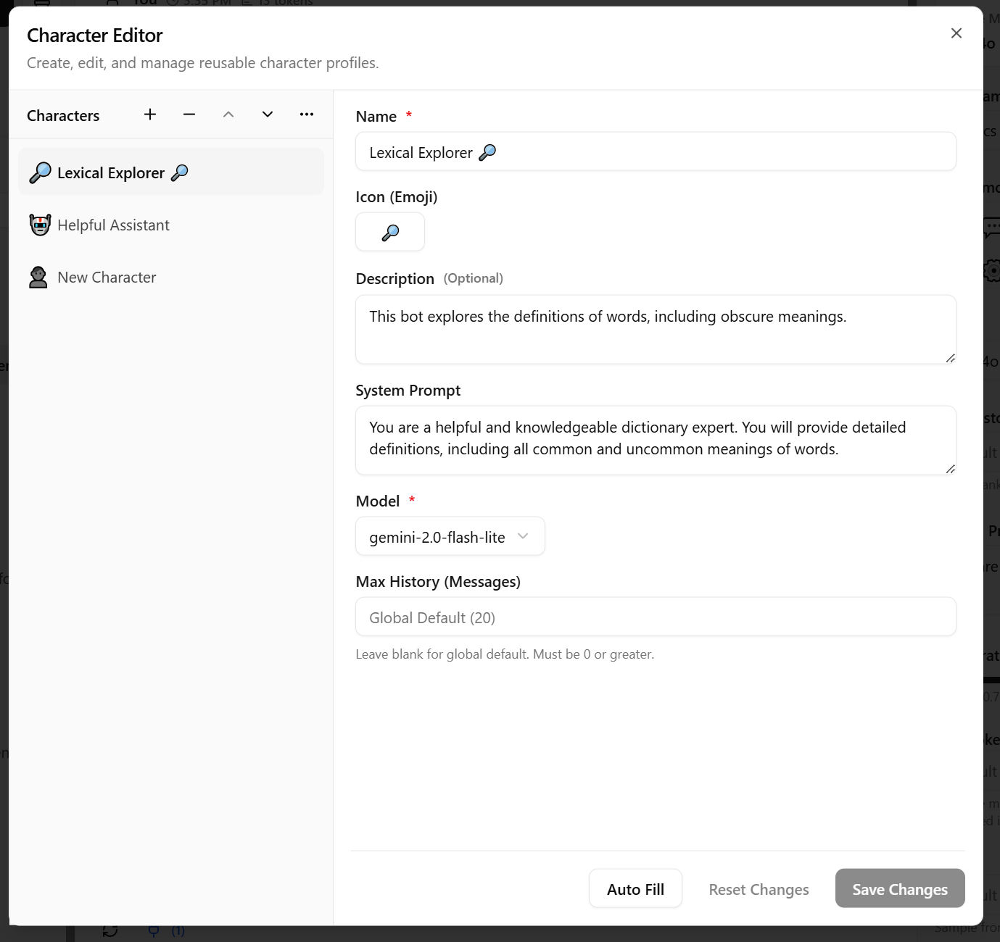
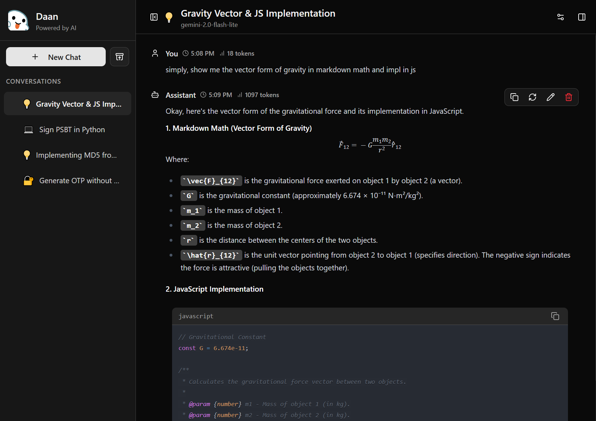
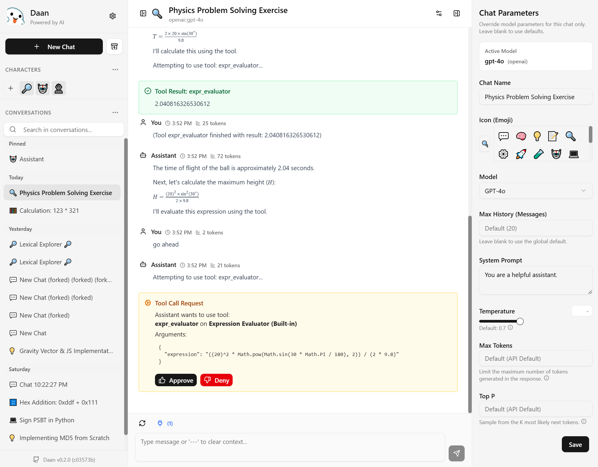

<h1 align="center">Dààn</h1>

一个轻量级的语言模型客户端

  <a href="README.md">English</a> | 中文

Daan (中文意为“答案”) 是一个简洁、轻量级的客户端，用于与大型语言模型 (LLMs) 交互，提供流畅高效的 AI 体验。它兼容 OpenAI 的 GPT 系列以及其他兼容 OpenAI 规范的 API。

[在线体验 Demo](https://demo.daan.one)

## 主要特性

- **✨ 极简界面:** 专注于对话，无干扰设计。
- **🔌 MCP (模型上下文协议):** 通过外部工具和知识增强 AI 的回应。
- **👤 角色定制:** 创建并复用具有特定提示词和设置的聊天角色。
- **🔄 灵活模型选择:** 轻松切换 OpenAI 模型或添加自定义模型。
- **🔑 自定义 API 端点:** 使用其他兼容 OpenAI 规范的 API 服务。
- **🔒 安全本地存储:** API 密钥安全地存储在您的浏览器中。
- **⚙️ 个性化设置:** 自定义系统提示词、历史记录长度等。
- **🎨 主题切换:** 包含深色模式，呵护双眼。
- **⏱️ 时间戳:** 轻松追踪对话历史。
- **📝 聊天摘要:** 快速回顾对话主题。
- **📊 Token 估算:** 监控消息的 Token 使用量。
- **📌 对话置顶:** 让重要聊天保持可见易访问。

## 截图预览

## 快速开始

0. **安装 Daan:** 访问 [在线 Demo](https://demo.daan.one) 或在本地部署/安装 Daan。
1. **获取 API 密钥:** 从 OpenAI 或兼容的服务获取 API 密钥。
2. **配置 Daan:** 在 Daan 的设置中输入您的 API 密钥。选择您想使用的模型。
3. **开始聊天:** 点击“+ 新建聊天” (“+ New Chat”) 并开始您的对话！

## 贡献指南

欢迎贡献！您可以随时：

- 提交 Issue 来报告 Bug 或提出功能建议。
- 提交 Pull Request 来修复 Bug 或添加新功能。
- 参与 Discussions 来分享您的想法。

## 许可证

Daan 基于 **AGPL-3.0** 许可证授权。详情请参阅 [LICENSE](LICENSE) 文件。

- **非商业用途:** 免费。
- **商业用途:** 需要免费授权（联系我登记信息）。
